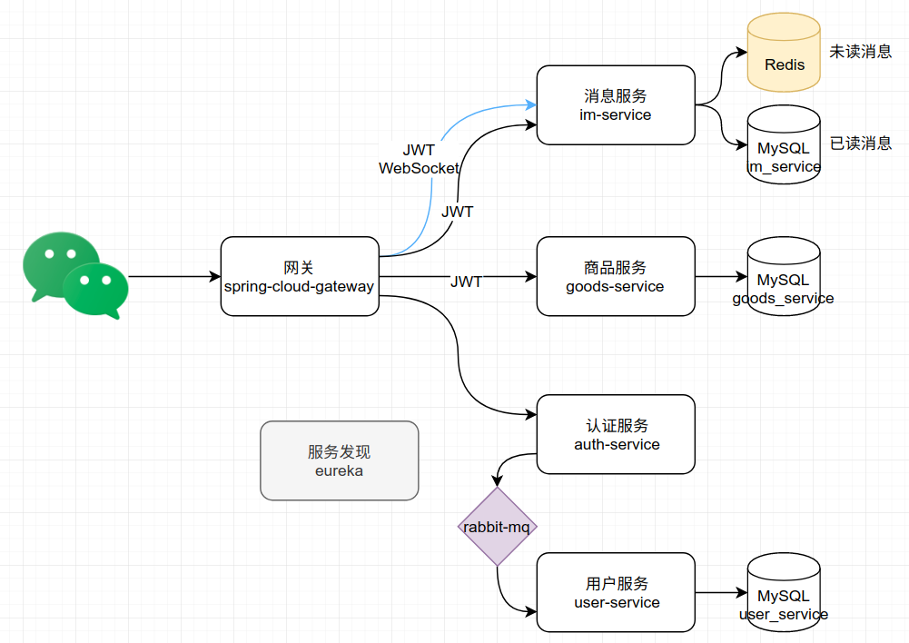
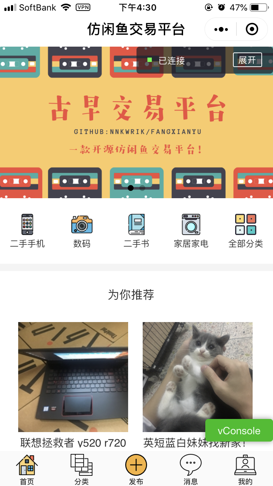
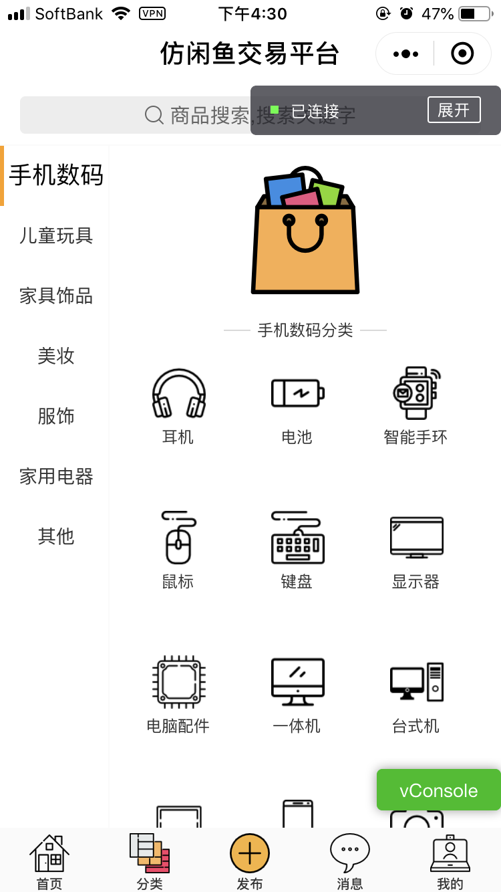
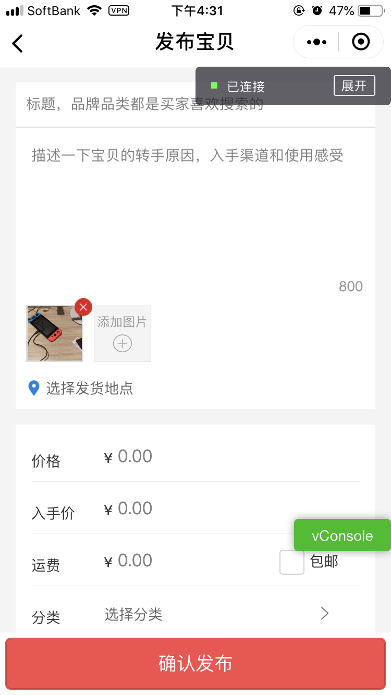
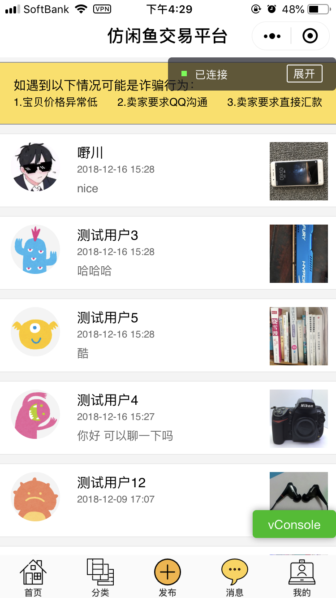
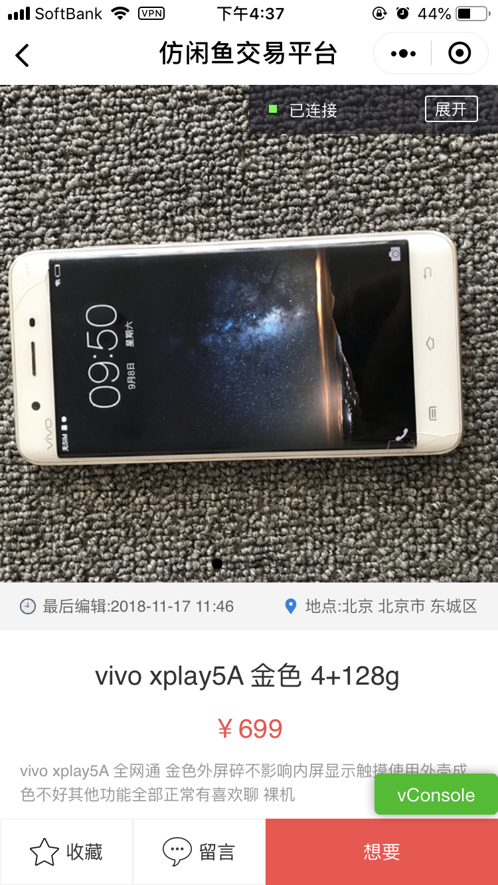
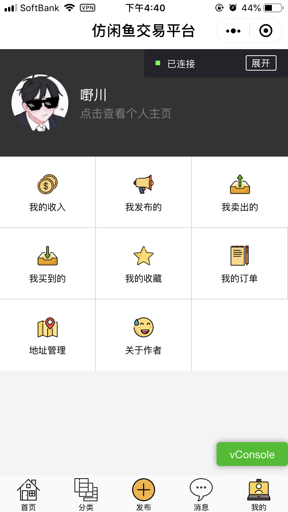
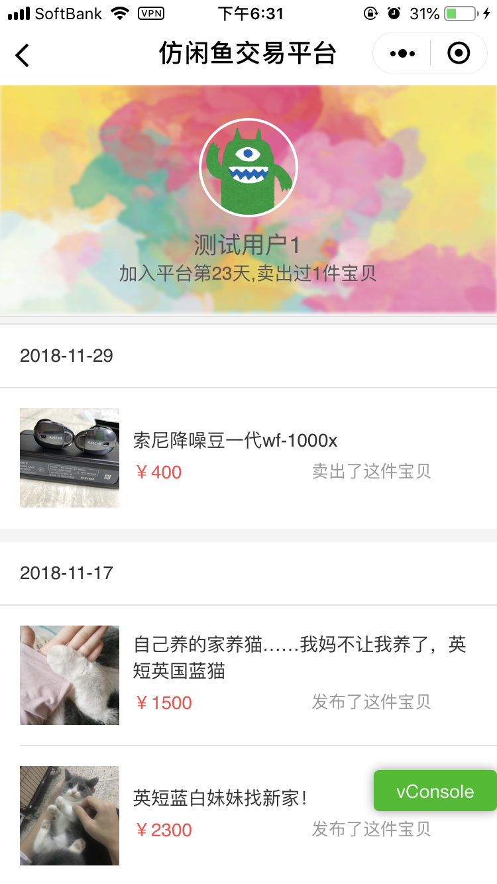
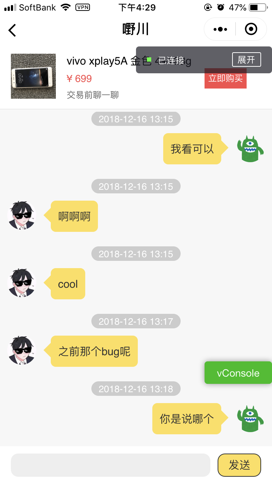
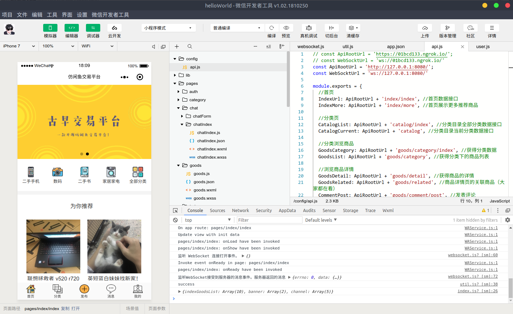

<p align="center">
</p>


一款高质量仿闲鱼开源交易平台。

Power By `微信小程序`,`JWT`, `Java8`,`Maven`,`SpringBoot`,`SpringCloud`,`MySQL`,`Redis`,`RabbitMQ`,`Docker`

# 🗃 目录

- [功能](https://github.com/nnkwrik/weapp-fangxianyu#-%E5%8A%9F%E8%83%BD)
- [后端服务拆分](https://github.com/nnkwrik/weapp-fangxianyu#-%E5%90%8E%E7%AB%AF%E6%9C%8D%E5%8A%A1%E6%8B%86%E5%88%86)
- [预览](https://github.com/nnkwrik/weapp-fangxianyu#-%E9%A2%84%E8%A7%88)
- [快速开始](https://github.com/nnkwrik/weapp-fangxianyu#-%E5%BF%AB%E9%80%9F%E5%BC%80%E5%A7%8B)
  - [前端](https://github.com/nnkwrik/weapp-fangxianyu#%E5%89%8D%E7%AB%AF)
  - [后端](https://github.com/nnkwrik/weapp-fangxianyu#%E5%90%8E%E7%AB%AF)
  - [真机调试](https://github.com/nnkwrik/weapp-fangxianyu#%E7%9C%9F%E6%9C%BA%E8%B0%83%E8%AF%95)
  - [移除docker搭建的镜像](https://github.com/nnkwrik/weapp-fangxianyu#%E7%A7%BB%E9%99%A4docker%E6%90%AD%E5%BB%BA%E7%9A%84%E9%95%9C%E5%83%8F)
- [非docker-compose部署](https://github.com/nnkwrik/weapp-fangxianyu#-%E9%9D%9Edocker-compose%E9%83%A8%E7%BD%B2)
- [端口](https://github.com/nnkwrik/weapp-fangxianyu#-%E7%AB%AF%E5%8F%A3)
  - [docker-compose环境下](https://github.com/nnkwrik/weapp-fangxianyu#docker-compose%E7%8E%AF%E5%A2%83%E4%B8%8B)
  - [非docker-compose环境下](https://github.com/nnkwrik/weapp-fangxianyu#%E9%9D%9Edocker-compose%E7%8E%AF%E5%A2%83%E4%B8%8B)
- [JWT](https://github.com/nnkwrik/weapp-fangxianyu#-jwt)
- [最后](https://github.com/nnkwrik/weapp-fangxianyu#%E6%9C%80%E5%90%8E)

# 🌀 功能

- 首页 : 广告banner,推荐分类,推荐商品
- 分类功能 : 2级分类,分类浏览商品
- 搜索功能 : 关键字搜索,搜索历史,热门关键字,搜索辅助,
- 浏览商品详情 :  商品信息,2级评论,卖家信息,相关商品,标记为收藏,标记为想要
- 发布商品 : 上传商品图,发货地点,支持多种交易方式
- 聊天功能 : 基于WebSocket,标记为想要后创建对话(模仿闲鱼),在聊天框中下单(模仿闲鱼)
- 其他功能 : 用户主页,查看自己发布,收藏,卖出,买到的商品
- 订单,支付 : **未完成**


# 🖇 后端服务拆分

后端基于Spring Cloud搭建,拆分为`认证`,`用户`,`消息`,`商品`,`服务发现`,`网关`6个服务




# 🗺 预览

<p align="center">
    
    
    
    
    
    
    
    
</p>

# 🚀 快速开始

## 前端

然而并不能快速开始，首先你得有小程序的appid。需要先申请小程序账号和下载小程序开发工具，步骤可以参考[官方教程](https://developers.weixin.qq.com/miniprogram/dev/)。注册完成后会拿到appid和secret，在`auth-service/src/main/resources/application.yml`中配置你的appid和secret。

```yml
#写入你的小程序信息
wx:
  miniapp:
    appid:  #微信小程序的appid
    secret: #微信小程序的Secret
    msgDataFormat: JSON
```

打开刚下载好的小程序开发工具，创建一个新项目。然后把[wx-front](https://github.com/nnkwrik/fangxianyu/tree/master/wx-front)中的所有文件覆盖到你刚创建的小程序项目目录中。由于小程序默认服务端只能是HTTPS并且是ICP备案过的域名，不方便开发，在小程序开发工具的`设置/项目设置`中把`不校验合法域名、web-view（业务域名）、TLS 版本以及 HTTPS 证书`勾上。

## 后端

后端用docker-compose快速部署，确保你安装了docker和docker-compose。（参考：[Ubuntu安装Docker](https://docs.docker.com/install/linux/docker-ce/ubuntu/)，[安装docker-compose](https://docs.docker.com/compose/install/)）。

```
$ git clone git@github.com:nnkwrik/weapp-fangxianyu.git
$ cd /weapp-fangxianyu
```

maven打包

```
mvn clean package -Dmaven.test.skip=true
```

打开docker-compose.yml看一下，确保和你本机的端口没有冲突。然后就可以docker部署啦

```
$ docker-compose build
$ docker-compose up
```

部署完成后稍等片刻（网关完全启动比较耗时），打开你的小程序开发工具，点击上方的`编译`就可以看到主页了。



## 真机调试

因为现在域名用的是localhost，手机是访问不到的，需要内网穿透。我在dev/ngrok/下放了linux版本的ngrok，如果你也是linux系统，直接运行里面的目录下的`start.sh`就行了，别的系统的话去谷歌找一下.. 随后会得到一个随机的域名（websocket通用），把它配置到小程序前端的config/api.js下，替换原来的localhost:8080。然后点`真机调试`就能通过手机访问到服务端了。

## 移除docker搭建的镜像

不想用了？ 删除所有相关镜像

```
$ docker-compose down
$ docker rmi $(docker images | grep fangxianyu |  awk '{print $3}')
```


# 🐢 非docker-compose部署

不想用docker-compose就只能一步步来了。

- 先启动3个基础服务。运行`dev/mysql`,`dev/redis`,`dev/rebbitmq`目录下的`start.sh`。

- 把6个服务（`auth-service`,`goods-service`,`user-service`,`im-service`,`eureka`,`gateway`）下Application启动类跑起来。

其他和快速开始一样


# 📡 端口

### docker-compose环境下

- MySQL : 3306
- Redis ： 6379
- Rabbit MQ ： 5672 （管理界面：15672）
- gateway : 8080

具体参考`docker-compose.yml`。基础服务的端口都可以不暴露，暴露出来是为了方便生产环境中调试

### 非docker-compose环境下

- MySQL : 3306
- Redis ： 6379
- Rabbit MQ ： 5672 （管理界面：15672）
- gateway ： 8080
- eureka ：8801
- user-service ： 8802
- auth-service ： 8803
- goods-service ：8804
- im-service ：8805


# 🔑 JWT

后端API基于Header中的JWT Token进行认证。如果你还不了解JWT的话可以先了解下，微服务认证的神器。

controller中通过@JWT注解把Token进行认证后转成JWTUser类。具体参考各个controller中的代码。在yml中可以配置秘钥文件的名字如：

```yml
jwt:
  pvt-key-file-name: RSA.key
  pub-key-file-name: RSA.pub
  duration: 1D  #JWT 1天过期
```

请确保resource目录下有你配置的这个秘钥文件。JWT发行方（auth-service）需要私钥（.key）,验证方（goods-service,im-service）需要公钥（.pub）。

如果你想改成新的秘钥，`io.github.nnkwrik.authservice.token.RSAKeysGenerator`中提供了RSA密钥对生成器。运行后会在`auth-service/src/main/resources`下生成新的秘钥对（.key和.pub）。把公钥（.pub）复制到需要JWT验证的服务（`goods-service`,`im-service`）的resource下，就能替换成新的秘钥了。


# 最后

- **别忘记Star！**
- 后端调用微信api认证的部分用到了[微信Java开发工具包](https://github.com/Wechat-Group/weixin-java-tools)的`weixin-java-miniapp`，非常感谢
- 前端参考了[NideShop商城](https://github.com/tumobi/nideshop-mini-program)小程序，非常感谢
- 订单和支付没有完成，随缘开发。
  [NideShop商城](https://github.com/tumobi/nideshop-mini-program)里好像已经有支付和订单的页面，有兴趣做二次开发的话可以参考一下
- 这次开发过程中遇到的坑都有在博客中做记录，可以看一下
  - [Spring Cloud中使用RabbitMQ的两种方式](https://nnkwrik.github.io/2018/11/19/20181119/)
  - [Guava的Cache](https://nnkwrik.github.io/2018/11/20/20181120/)
  - [万能的Jackson](https://nnkwrik.github.io/2018/11/30/20181130/)
- 有问题吗？微信号：nnkwrik